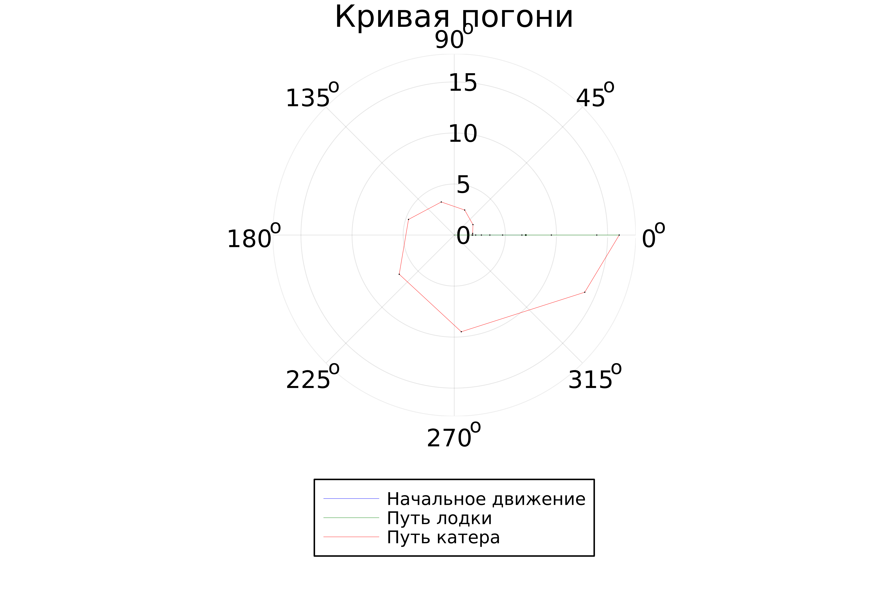
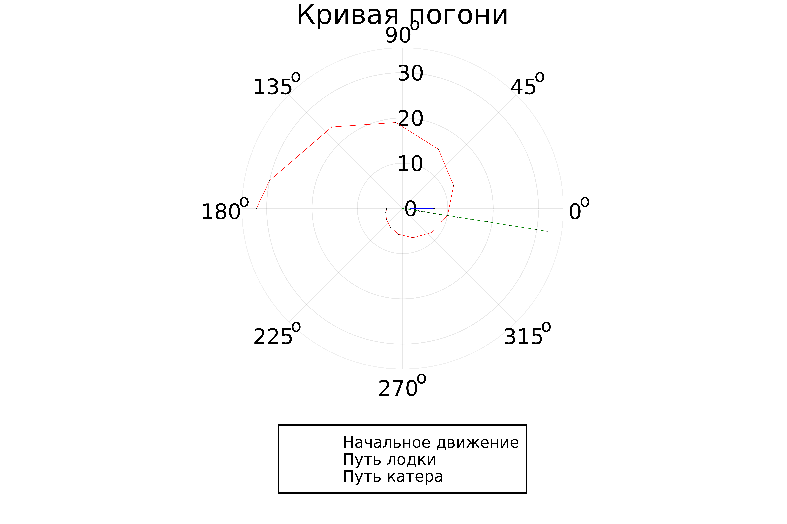

---
## Front matter
title: "Лабораторная работа № 2"
subtitle: "Задача о погоне"
author: "Егорова Диана Витальевна"

## Generic otions
lang: ru-RU
toc-title: "Содержание"

## Bibliography
bibliography: bib/cite.bib
csl: pandoc/csl/gost-r-7-0-5-2008-numeric.csl

## Pdf output format
toc: true # Table of contents
toc-depth: 2
lof: true # List of figures
lot: false
fontsize: 12pt
linestretch: 1.5
papersize: a4
documentclass: scrreprt
## I18n polyglossia
polyglossia-lang:
  name: russian
  options:
	- spelling=modern
	- babelshorthands=true
polyglossia-otherlangs:
  name: english
## I18n babel
babel-lang: russian
babel-otherlangs: english
## Fonts
mainfont: PT Serif
romanfont: PT Serif
sansfont: PT Sans
monofont: PT Mono
mainfontoptions: Ligatures=TeX
romanfontoptions: Ligatures=TeX
sansfontoptions: Ligatures=TeX,Scale=MatchLowercase
monofontoptions: Scale=MatchLowercase,Scale=0.9
## Biblatex
biblatex: true
biblio-style: "gost-numeric"
biblatexoptions:
  - parentracker=true
  - backend=biber
  - hyperref=auto
  - language=auto
  - autolang=other*
  - citestyle=gost-numeric
## Pandoc-crossref LaTeX customization
figureTitle: "Рис."
tableTitle: "Таблица"
listingTitle: "Листинг"
lofTitle: "Список иллюстраций"
lotTitle: "Список таблиц"
lolTitle: "Листинги"
## Misc options
indent: true
header-includes:
  - \usepackage{indentfirst}
  - \usepackage{float} # keep figures where there are in the text
  - \floatplacement{figure}{H} # keep figures where there are in the text
---

# Цель работы

Целью данной работы является решение задачи о погоне. И расмотрение примера построения математических моделей для выбора правильной стратегии при решении поиска задач

# Задание

* Провести рассуждения и вывести дифференциальные уравнения и записать уравнение, описывающее движение катера с начальными условиями для двух случаев
* Построить траекторию движения катера и лодки для двух случаев
* Определить точку пересечения траектории катера и лодки 

# Теоретическое введение

Тангенциальная скорость (Vt) [1] - компонента ускорения, направленная по касательной к траектории движения. Характеризует изменение модуля скорости, в отличие от нормальной компоненты, характеризующей изменение направления скорости.

Теорема Пифагора [2] - в прямоугольном треугольнике квадрат длины гипотенузы равен сумме квадратов длин катетов. 

радиальная скорость [3] - в цилиндрической (и полярной) и сферической системах координат — одна из компонент скорости (другая компонента — азимутальная (трансверсальная) скорость). Таким образом, она является обобщённой скоростью в этих системах координат.

# Выполнение лабораторной работы

1. По приложенному файлу на ТУИС проведем аналогичные исследования 3 (@fig:001).

* Принимаем за $t_0=0, X_0=0$  - место нахождения лодки браконьеров в момент, когда их обнаруживают катера береговой охраны. После введем полярные координаты.
Время, за которое они пройдут это расстояние, вычисляется как $\frac{x}{υ}$ или $\frac{x+k}{υ}$ (для второго случая $\frac{x-k}{υ}$).  Так как время одно и то же, то эти величины одинаковы. 
Тогда неизвестное расстояние можно найти из следующего уравнения:  $\frac{x}{υ} = \frac{x+k}{υ}$ - в первом случае, $\frac{x}{υ} =  \frac{x-k}{υ}$ во втором случае.

* Отсюда мы найдем два значения $x_1$ и $x_2$, задачу будем решать для двух случаев : 

    $x_1=\frac{k}{n+1}$ ,при $\theta=0$
    $x_2=\frac{k}{n-1}$ ,при $\theta=-\pi$

* Найдем тангенциальную скорость[1] для нашей задачи $υ_t=r\frac{d\theta}{dt}$.
Вектора образуют прямоугольный треугольник, откуда по теореме Пифагора[2] можно найти тангенциальную скорость $υ_t= \sqrt{n^2 υ_r^2-v^2}$. Поскольку, радиальная скорость[3] равна $υ$, то тангенциальную скорость находим из уравнения $υ_t= \sqrt{n^2 υ^2-υ^2 }$. Следовательно, $υ_τ=υ\sqrt{n^2-1}$.
* Тогда получаем $r\frac{d\theta}{dt}=υ\sqrt{n^2-1}$

{#fig:001 width=90%}

2. Построим траектории движения катера береговой охраны и лодки с помощью Julia  (@fig:005 - @fig:007).

{#fig:002 width=70%}

{#fig:003 width=70%}

{#fig:004 width=70%}

3. Построение траекторий с помощью языка OpenModelica не имеет смысла, так как это невозможно сделать, используя стандартные методы.

# Выводы

В итоге проделанной работы я решила задачу о погоне и построила траектории движения лодки и катера с помощью языка Julia. Также я узнала, что построение траекторий движения для данного
случая не является подходящей задачей для языка OpenModelica.

# Список литературы{.unnumbered}

[1]https://ru.wikipedia.org/wiki/%D0%A2%D0%B0%D0%BD%D0%B3%D0%B5%D0%BD%D1%86%D0%B8%D0%B0%D0%BB%D1%8C%D0%BD%D0%BE%D0%B5_%D1%83%D1%81%D0%BA%D0%BE%D1%80%D0%B5%D0%BD%D0%B8%D0%B5

[2] https://skysmart.ru/articles/mathematic/teorema-pifagora-formula

[3] https://dic.academic.ru/dic.nsf/ruwiki/87991
