---
## Front matter
lang: ru-RU
title: Отчет по лабораторной работе №4
subtitle: Модель гармонических колебаний
author:
  - Егорова Диана Витальевна
institute:
  - Российский университет дружбы народов, Москва, Россия
date: 04 марта 2023

## i18n babel
babel-lang: russian
babel-otherlangs: english

## Formatting pdf
toc: false
toc-title: Содержание
slide_level: 2
aspectratio: 169
section-titles: true
theme: metropolis
mainfont: PT Serif 
romanfont: PT Serif 
sansfont: PT Sans
monofont: PT Mono
header-includes:
 - \metroset{progressbar=frametitle,sectionpage=progressbar,numbering=fraction}
 - '\makeatletter'
 - '\beamer@ignorenonframefalse'
 - '\makeatother'
---

# Информация

## Докладчик

:::::::::::::: {.columns align=center}
::: {.column width="70%"}

  * Егорова Диана Витальевна
  * студент НФИбд-01-20
  * Российский университет дружбы народов
  * [1032201662@rudn.ru](mailto:1032201662@rudn.ru)

:::
::::::::::::::

# Вводная часть

## Актуальность

- Моделирование ситуации
- Наглядное представление
- Простота использования

## Цели и задачи

- Построить фазовый портрет гармонического осциллятора и решение уравнения гармонического осциллятора
- Представить результаты в виде графиков
- Выполнить работу на Julia и OpenModelica

## Материалы и методы

- Язык `Julia` и ее библиотеки: `Plots` и `DifferentialEquations` для построения графиков
- Свободное открытое программное обеспечение `OpenModelica` для моделирования ситуации  

# Ход работы

## Строим фазовый портрет гармонического осциллятора и решение уравнения гармонического осциллятора для следующих случаев

1. Колебания гармонического осциллятора без затуханий и без действий внешней силы

2. Колебания гармонического осциллятора c затуханием и без действий внешней силы 

3. Колебания гармонического осциллятора c затуханием и под действием внешней силы 

## Код моделирования первого случая на Julia

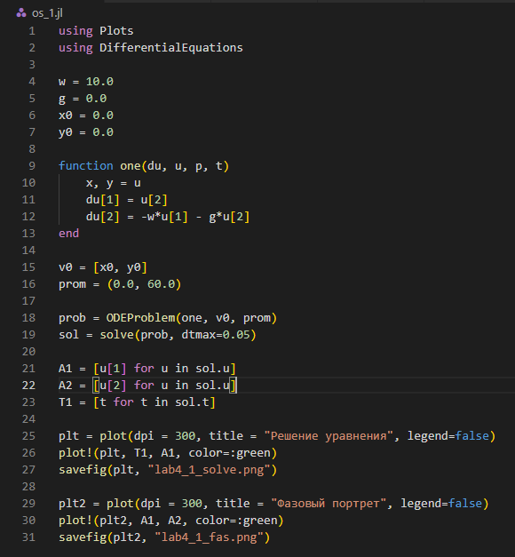{#fig:001 heigh=90% width=70%}

## Решение уравнения гармонического осциллятора в первом случае

{#fig:002 heigh=90% width=70%}

## Фазовый портрет гармонического осциллятора в первом случае

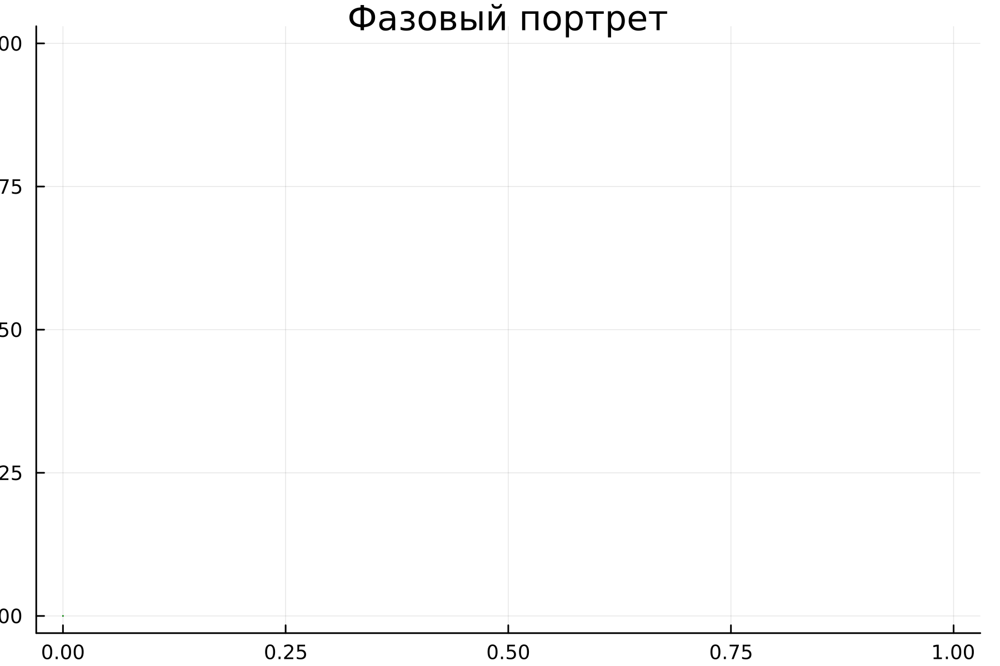{#fig:003 heigh=90% width=70%}

## Код моделирования второго случая на Julia

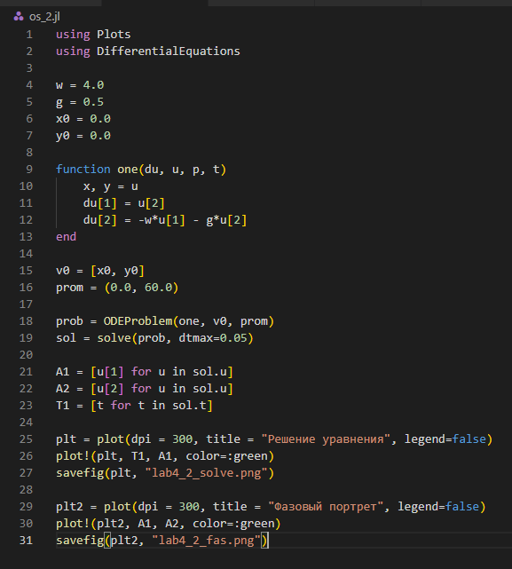{#fig:004 heigh=90% width=70%}

## Решение уравнения гармонического осциллятора во втором случае

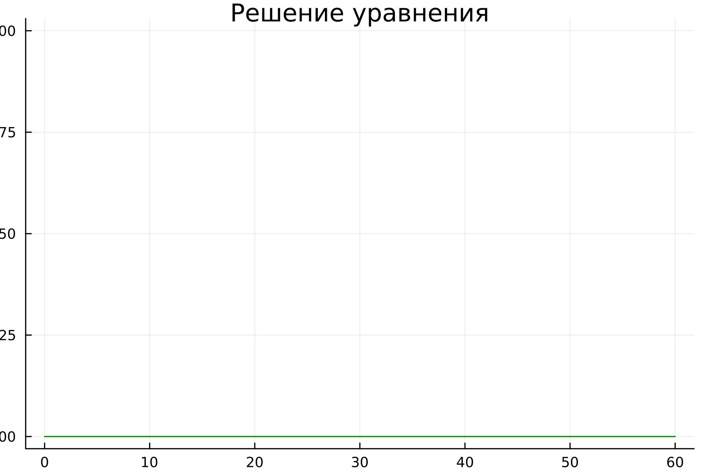{#fig:005 heigh=90% width=70%}

## Фазовый портрет гармонического осциллятора во втором случае

{#fig:006 heigh=90% width=70%}

## Код моделирования третьего случая на Julia

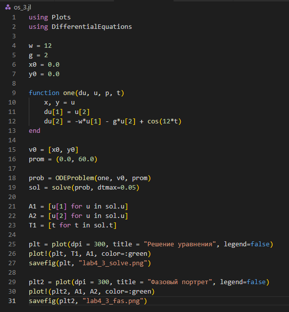{#fig:007 heigh=90% width=70%}

## Решение уравнения гармонического осциллятора в третьем случае

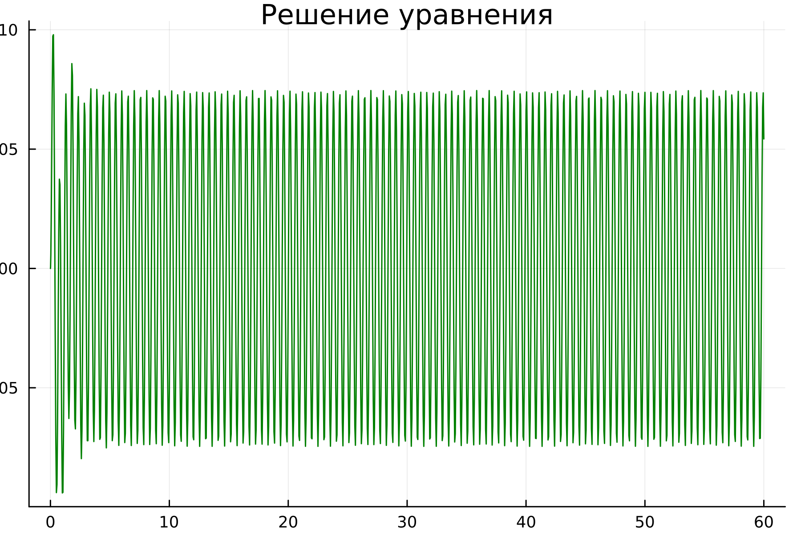{#fig:008 heigh=90% width=70%}

## Фазовый портрет гармонического осциллятора в третьем случае

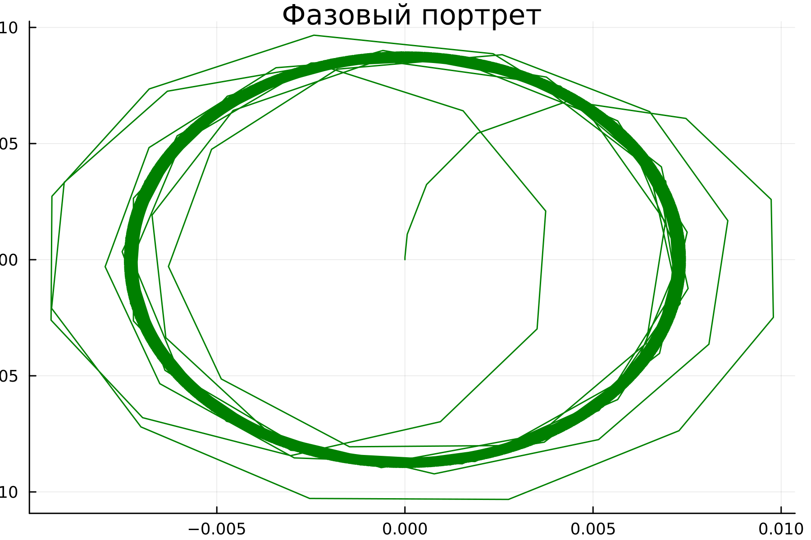{#fig:009 heigh=90% width=70%}

## Код моделирования первого случая на OpenModelica

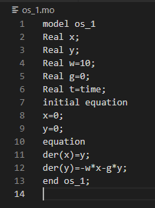{#fig:010 heigh=90% width=70%}

## Решение уравнения гармонического осциллятора в первом случае

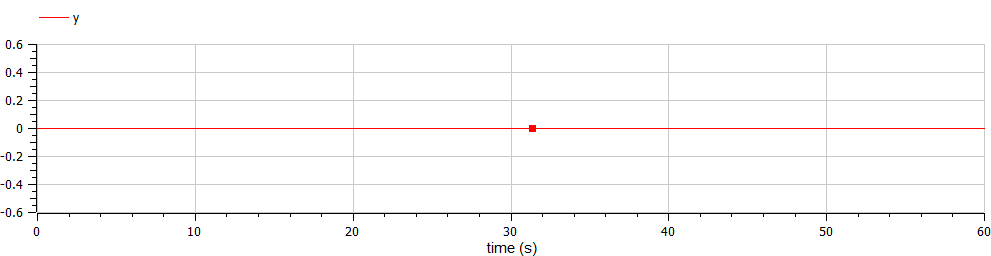{#fig:011 heigh=90% width=70%}

## Фазовый портрет гармонического осциллятора в первом случае

{#fig:012 heigh=90% width=70%}

## Код моделирования второго случая на OpenModelica

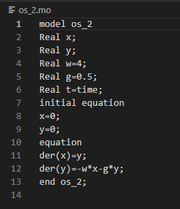{#fig:013 heigh=90% width=70%}

## Решение уравнения гармонического осциллятора во втором случае

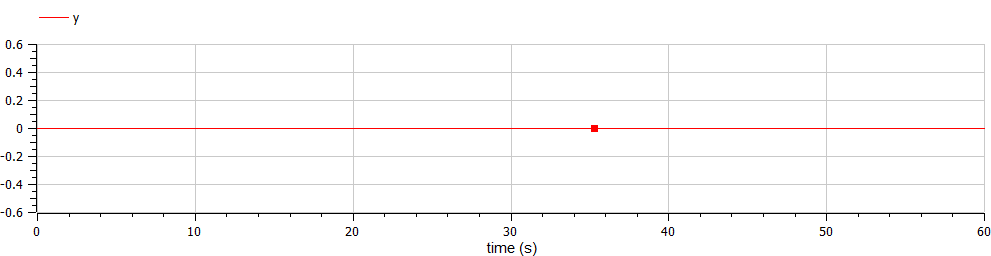{#fig:014 heigh=90% width=70%}

## Фазовый портрет гармонического осциллятора во втором случае

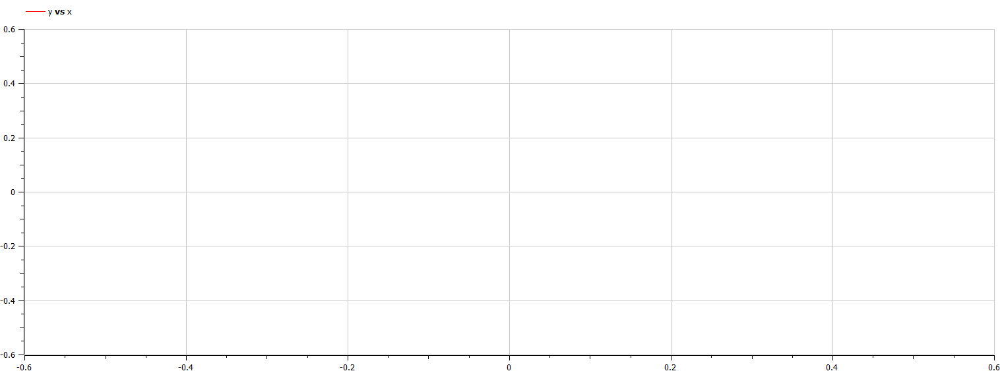{#fig:015 heigh=90% width=70%}

## Код моделирования третьего случая на OpenModelica

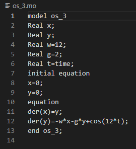{#fig:016 heigh=90% width=70%}

## Решение уравнения гармонического осциллятора в третьем случае

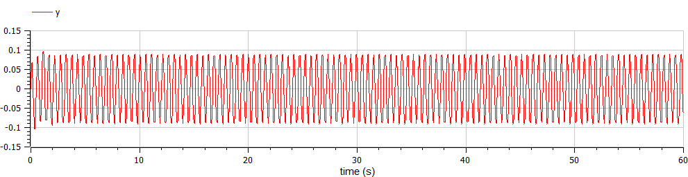{#fig:017 heigh=90% width=70%}

## Фазовый портрет гармонического осциллятора в третьем случае

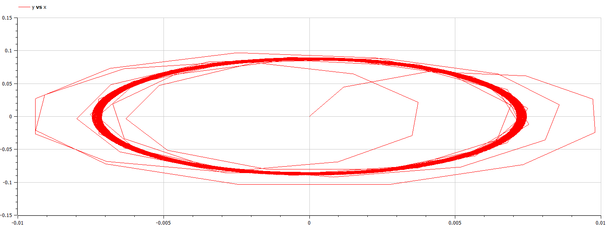{#fig:018 heigh=90% width=70%}

# Результаты
## Результаты выполнения

- Моделирование ситуации
- Ознакомление с языками
- Построение фазового портрета гармонического осциллятора
- Решение уравнения гармонического осциллятора
- Сравнение языков

