---
## Front matter
title: "Отчет по лабораторной работе №4"
subtitle: "Модель гармонических колебаний"
author: "Егорова Диана Витальевна"

## Generic otions
lang: ru-RU
toc-title: "Содержание"

## Bibliography
bibliography: bib/cite.bib
csl: pandoc/csl/gost-r-7-0-5-2008-numeric.csl

## Pdf output format
toc: true # Table of contents
toc-depth: 2
lof: true # List of figures
lot: true # List of tables
fontsize: 12pt
linestretch: 1.5
papersize: a4
documentclass: scrreprt
## I18n polyglossia
polyglossia-lang:
  name: russian
  options:
	- spelling=modern
	- babelshorthands=true
polyglossia-otherlangs:
  name: english
## I18n babel
babel-lang: russian
babel-otherlangs: english
## Fonts
mainfont: PT Serif
romanfont: PT Serif
sansfont: PT Sans
monofont: PT Mono
mainfontoptions: Ligatures=TeX
romanfontoptions: Ligatures=TeX
sansfontoptions: Ligatures=TeX,Scale=MatchLowercase
monofontoptions: Scale=MatchLowercase,Scale=0.9
## Biblatex
biblatex: true
biblio-style: "gost-numeric"
biblatexoptions:
  - parentracker=true
  - backend=biber
  - hyperref=auto
  - language=auto
  - autolang=other*
  - citestyle=gost-numeric
## Pandoc-crossref LaTeX customization
figureTitle: "Рис."
tableTitle: "Таблица"
listingTitle: "Листинг"
lofTitle: "Список иллюстраций"
lotTitle: "Список таблиц"
lolTitle: "Листинги"
## Misc options
indent: true
header-includes:
  - \usepackage{indentfirst}
  - \usepackage{float} # keep figures where there are in the text
  - \floatplacement{figure}{H} # keep figures where there are in the text
---

# Цель работы

- Построить фазовый портрет гармонического осциллятора и решение уравнения гармонического осциллятора   
- Выполнить работу на Julia и OpenModelica

# Задание

Постройте фазовый портрет гармонического осциллятора и решение уравнения гармонического осциллятора для следующих случаев:
1. Колебания гармонического осциллятора без затуханий и без действий внешней силы  
2. Колебания гармонического осциллятора c затуханием и без действий внешней силы   
3. Колебания гармонического осциллятора c затуханием и под действием внешней силы на интервале $t \in [0; 60]$; (шаг 0.05) с начальными условиями $x_0 = 0; y_0 = 0$  

# Теоретическое введение

Осцилля́тор (лат. oscillo — качаюсь) — система, совершающая колебания, то есть показатели которой периодически повторяются во времени. [1]
Математи́ческий ма́ятник — осциллятор, представляющий собой механическую систему, состоящую из материальной точки на конце невесомой нерастяжимой нити или лёгкого стержня и находящуюся в однородном поле сил тяготения. [2]

Уравнение свободных колебаний гармонического осциллятора имеет следующий вид:  

$$\ddot{x} + 2\gamma\dot{x} + \omega_0^2x = 0 (1)$$  

где $x$ – переменная, описывающая состояние системы (смещение грузика, заряд конденсатора и т.д.), $\gamma$ – параметр, характеризующий потери энергии (трение в механической системе, сопротивление в контуре), $\omega_0$ – собственная частота колебаний, t – время. 

Уравнение (1) есть линейное однородное дифференциальное уравнение второго порядка и оно является примером линейной динамической системы. При отсутствии потерь в системе ($\gamma$ = 0) вместо уравнения (1.1) получаем уравнение консервативного осциллятора энергия колебания которого сохраняется во времени.

$$\ddot{x} + \omega_0^2x = 0 (2)$$  

Для однозначной разрешимости уравнения второго порядка (2) необходимо задать два начальных условия вида

$$\begin{cases} x(t_0) = x_0 \\ \dot{x}(t_0) = y_0 \end{cases} (3)$$ 

Уравнение второго порядка (2) можно представить в виде системы двух уравнений первого порядка:

$$\begin{cases} \dot{x} = y \\ \dot{y}(t_0) = -\omega_0^2x \end{cases} (4)$$ 

Начальные условия (3) для системы (4) примут вид:

$$\begin{cases} x(t_0) = x_0 \\ y(t_0) = y_0 \end{cases} (3)$$ 

Независимые переменные x, y определяют пространство, в котором «движется» решение. Это фазовое пространство системы, поскольку оно двумерно будем называть его фазовой плоскостью. Значение фазовых координат x, y в любой момент времени полностью определяет состояние системы. Решению уравнения движения как функции времени отвечает гладкая кривая в фазовой плоскости. Она называется фазовой траекторией. Если множество различных решений (соответствующих различным начальным условиям) изобразить на одной фазовой плоскости, возникает общая картина поведения системы. Такую картину, образованную набором фазовых траекторий, называют фазовым портретом.

# Выполнение лабораторной работы

1. Построим фазовый портрет и решения уравнения гармонического осциллятора без затуханий и без действий внешней силы на Julia (рис. @fig:001).

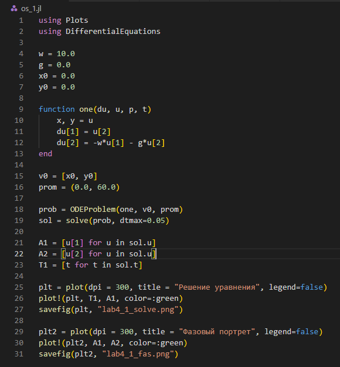 {#fig:001 width=70%}

Результат выполнения моделирования колебания гармонического осциллятора в первом случае (рис. @fig:002) (рис. @fig:003).

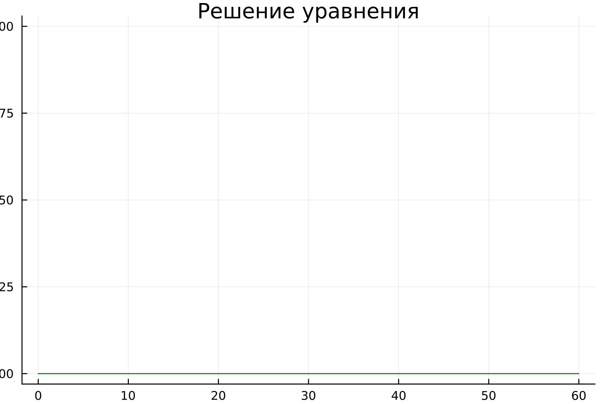 {#fig:002 width=70%}

 {#fig:003 width=70%}

2. Построим фазовый портрет и решения уравнения гармонического осциллятора c затуханием и без действий внешней силы на Julia (рис. @fig:004).

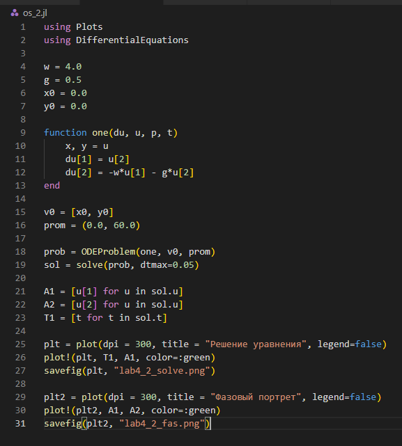 {#fig:004 width=70%}

Результат выполнения моделирования колебания гармонического осциллятора дл второго случая (рис. @fig:005) (рис. @fig:006).

 {#fig:005 width=70%}

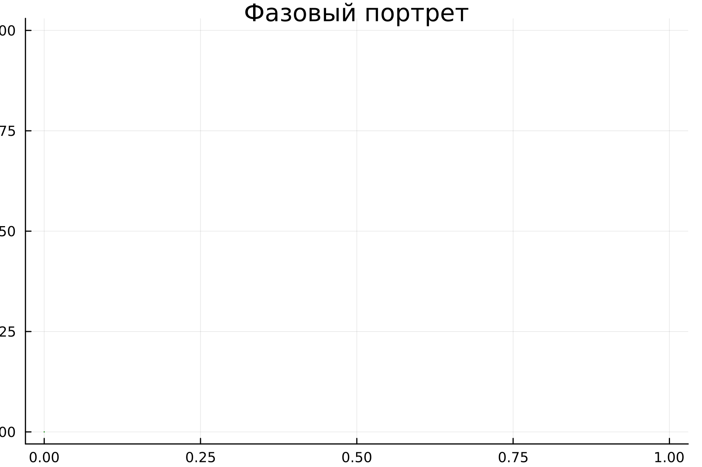 {#fig:006 width=70%}

3. Построим фазовый портрет и решения уравнения гармонического осциллятора c затуханием и под действием внешней силы на Julia (рис. @fig:007).

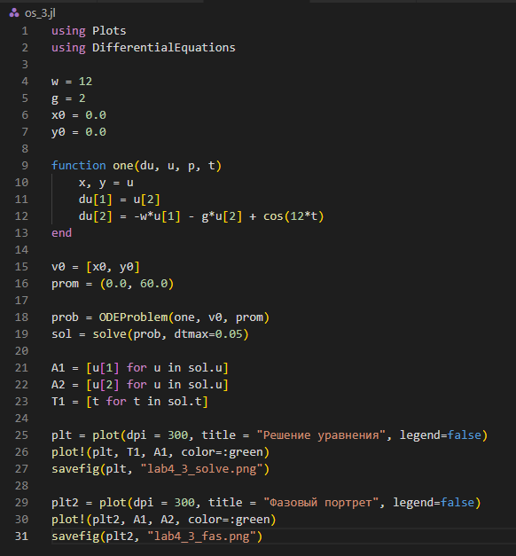 {#fig:007 width=70%}

Результат выполнения моделирования колебания гармонического осциллятора дл третьего случая (рис. @fig:008) (рис. @fig:009).

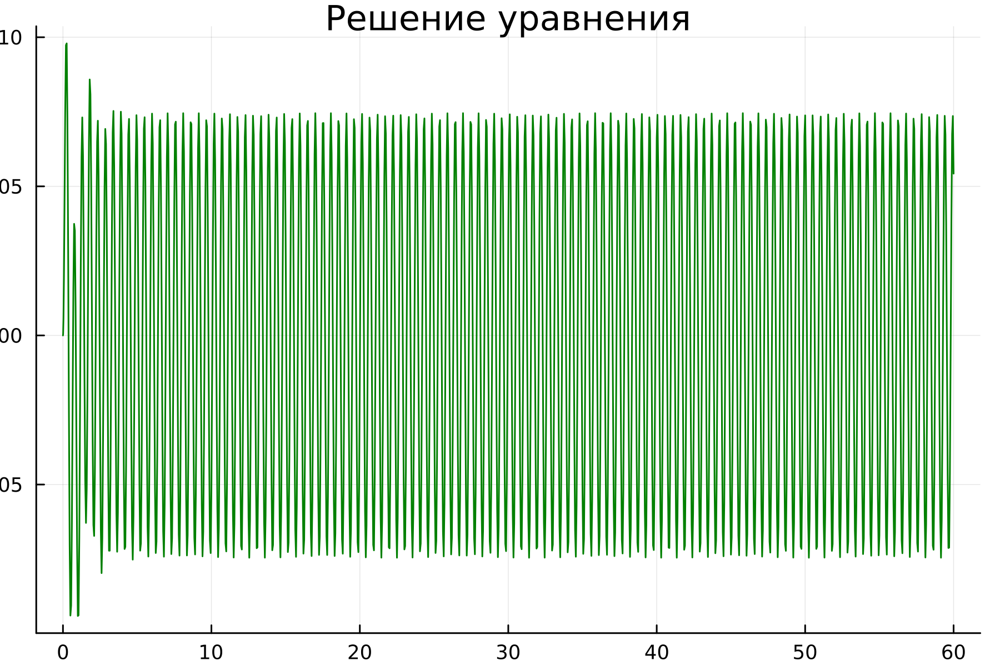 {#fig:005 width=70%}

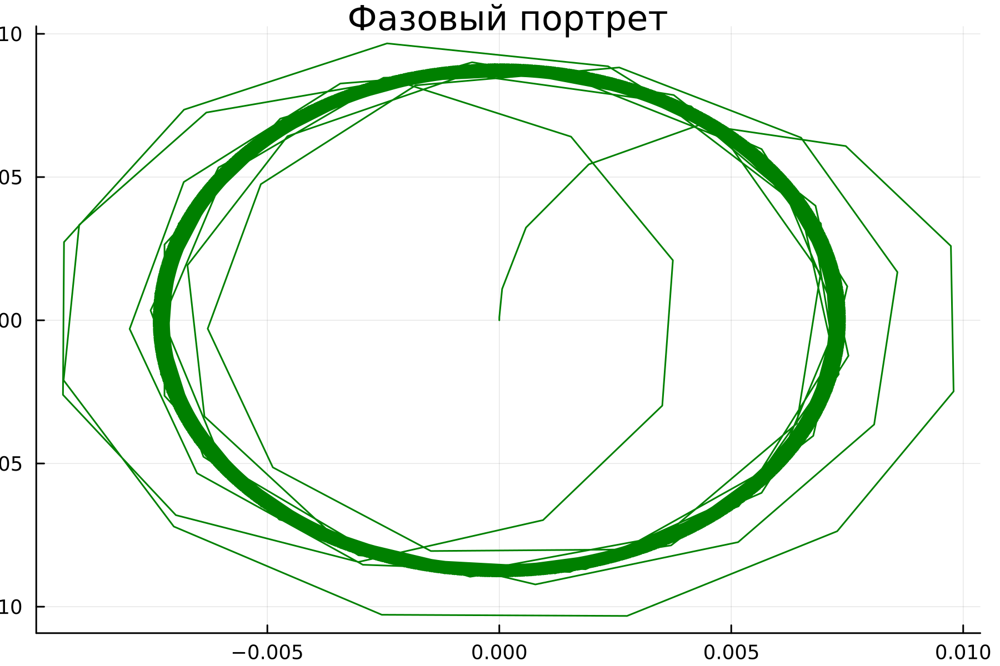 {#fig:006 width=70%}

4. Построим фазовый портрет и решения уравнения гармонического осциллятора без затуханий и без действий внешней силы на OpenModelica(рис. @fig:010).

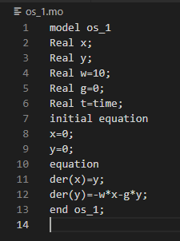 {#fig:010 width=70%}

Результат выполнения моделирования колебания гармонического осциллятора в первом случае (рис. @fig:011) (рис. @fig:012).

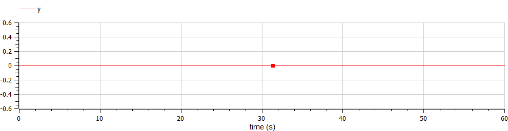 {#fig:011 width=70%}

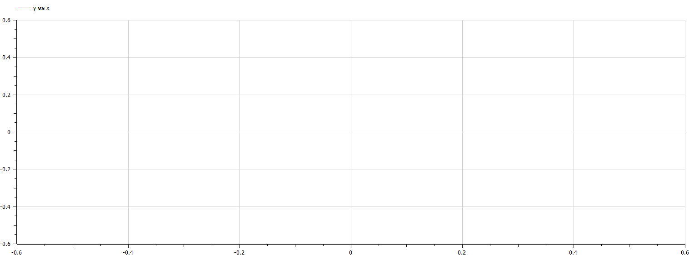 {#fig:012 width=70%}

5. Построим фазовый портрет и решения уравнения гармонического осциллятора c затуханием и без действий внешней силы на OpenModelica (рис. @fig:013).

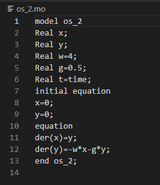 {#fig:013 width=70%}

Результат выполнения моделирования колебания гармонического осциллятора дл второго случая (рис. @fig:014) (рис. @fig:015).

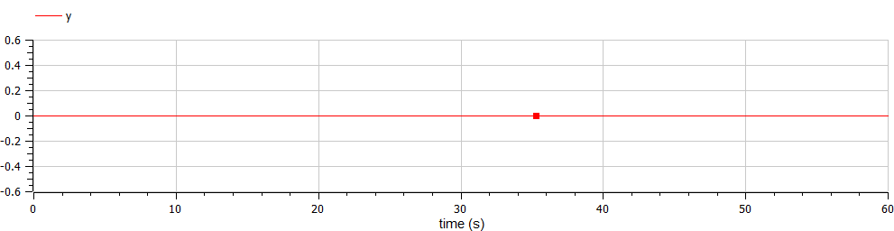 {#fig:014 width=70%}

 {#fig:015 width=70%}

6. Построим фазовый портрет и решения уравнения гармонического осциллятора c затуханием и под действием внешней силы на OpenModelica (рис. @fig:016).

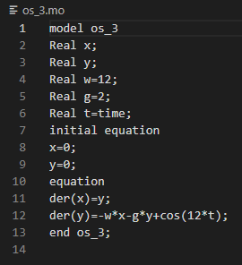 {#fig:016 width=70%}

Результат выполнения моделирования колебания гармонического осциллятора дл третьего случая (рис. @fig:017) (рис. @fig:018).

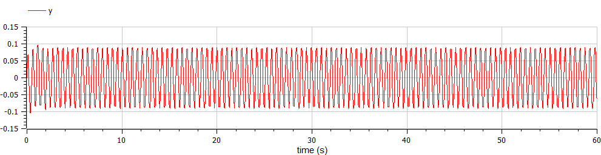 {#fig:017 width=70%}

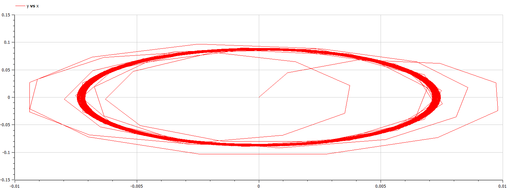 {#fig:018 width=70%}

# Выводы

Получены навыки моделирования фазового портрета гармонического осциллятора и решение уравнения гармонического осциллятора для следующих случаев:
1. Колебания гармонического осциллятора без затуханий и без действий внешней силы  
2. Колебания гармонического осциллятора c затуханием и без действий внешней силы   
3. Колебания гармонического осциллятора c затуханием и под действием внешней силы    

# Список литературы{.unnumbered}

[1] - https://clck.ru/33gUui  
[2] - https://clck.ru/GE8ba
::: {#refs}
:::
