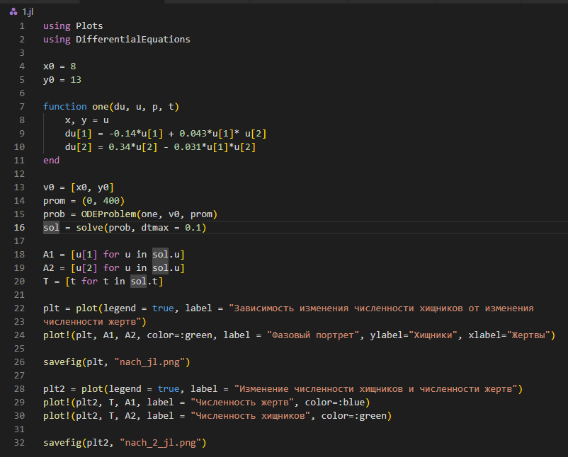
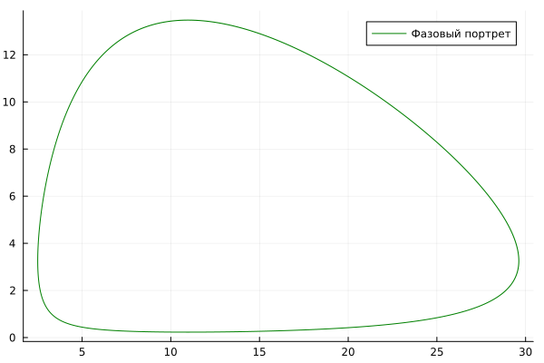
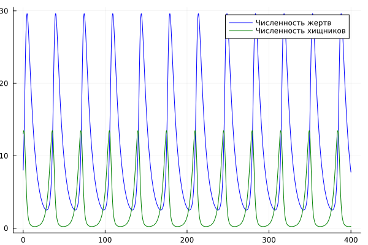
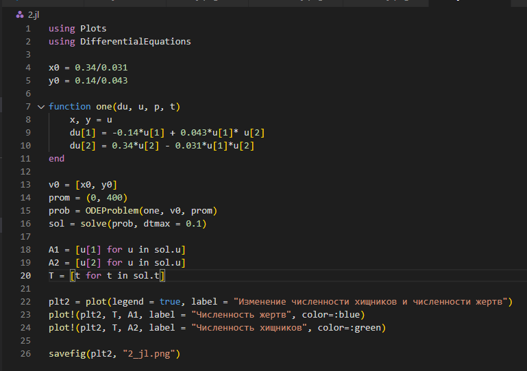
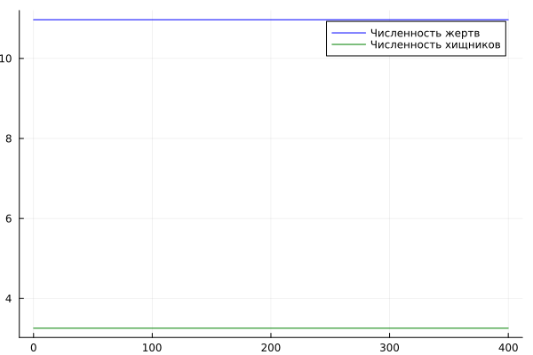
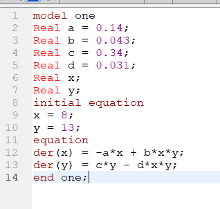
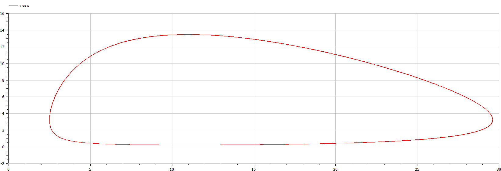
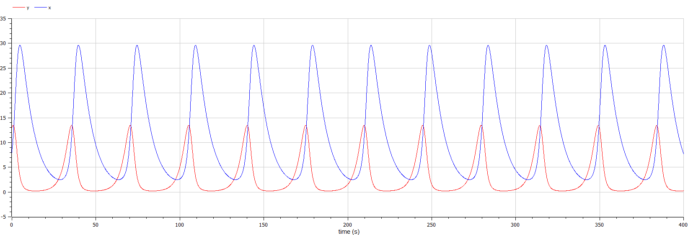
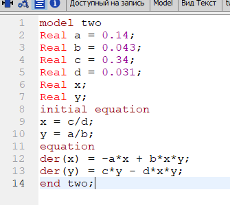
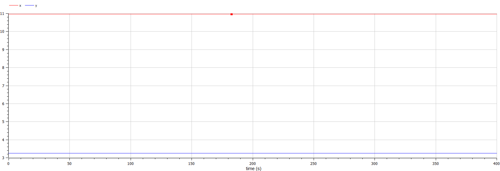

---
## Front matter
lang: ru-RU
title: Лабораторная работа №5
subtitle: Модель хищник-жертва"
author:
  - Егорова Д.В.
institute:
  - Российский университет дружбы народов, Москва, Россия
date: 11 марта 2023

## i18n babel
babel-lang: russian
babel-otherlangs: english

## Formatting pdf
toc: false
toc-title: Содержание
slide_level: 2
aspectratio: 169
section-titles: true
theme: metropolis
header-includes:
 - \metroset{progressbar=frametitle,sectionpage=progressbar,numbering=fraction}
 - '\makeatletter'
 - '\beamer@ignorenonframefalse'
 - '\makeatother'
---

# Информация

## Докладчик

:::::::::::::: {.columns align=center}
::: {.column width="70%"}

  * Егорова Диана Витальевна
  * студент НФИбд-01-20
  * Российский университет дружбы народов
  * [1032201662@rudn.ru](mailto:1032201662@rudn.ru)

:::
::::::::::::::

# Вводная часть

## Актуальность

- Моделирование ситуации
- Наглядное представление
- Простота использования

## Цели и задачи

- Разобрать задачу Лотки-Вольтерры.
- Построить график зависимости численности хищников от численности жертв
- Построить графики изменения численности хищников и численности жертв при следующих начальных условиях: $x_0 = 8, y_0 = 13$. 
- Найти стационарное состояние системы.

## Материалы и методы

- Язык `Julia` и ее библиотеки: `Plots` и `DifferentialEquations` для построения графиков
- Свободное открытое программное обеспечение `OpenModelica` для моделирования ситуации 
 
# Ход работы

## Напишем код программы на julia. Построение зависимости численности популяций хищников и жертв (фазовый портрет системы) и изменение количества численности хищников и жертв при начальном условие.
{#fig:001 width=70%}

## Зависимость изменения численности хищников от изменения численности жертв.
{#fig:002 width=70%}

## Изменение численности хищников и численности жертв.
{#fig:003 width=70%}

## Напишем код программы на julia. Найдем стационарное состояние.
{#fig:004 width=70%}

## Изменение численности хищников и численности жертв.
{#fig:005 width=70%}

## Смоделируем ситуацию в OpenModelica. Построение зависимости численности популяций хищников и жертв (фазовый портрет системы) и изменение количества численности хищников и жертв при начальном условие.
{#fig:006 width=70%}

## Зависимость изменения численности хищников от изменения численности жертв.
{#fig:007 width=70%}

## Изменение численности хищников и численности жертв.
{#fig:008 width=70%}

## Смоделируем ситуацию в OpenModelica. Найдем стационарное состояние.
{#fig:009 width=70%}

## Изменение численности хищников и численности жертв.
{#fig:010 width=70%}

# Результаты
## Результаты
- Моделирование ситуации
- Ознакомление с языками
- Построение графика зависимости численности хищников от численности жертв
- Построение графика изменения численности хищников и численности жертв при следующих начальных условиях: $x_0 = 8, y_0 = 13$
- Нахождение стационарного состояния системы

