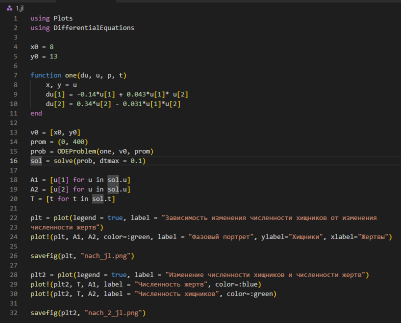
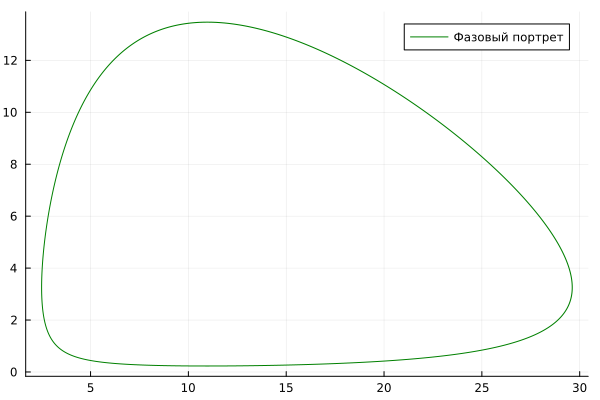
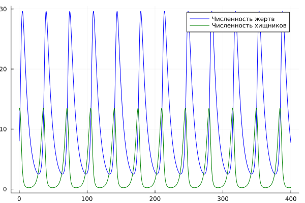
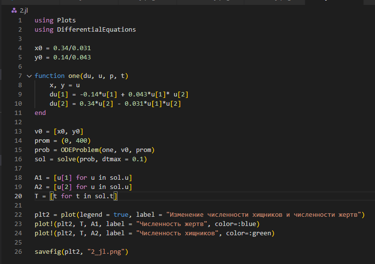
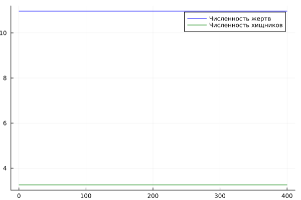
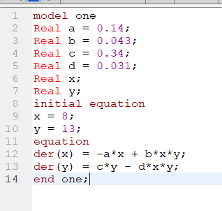
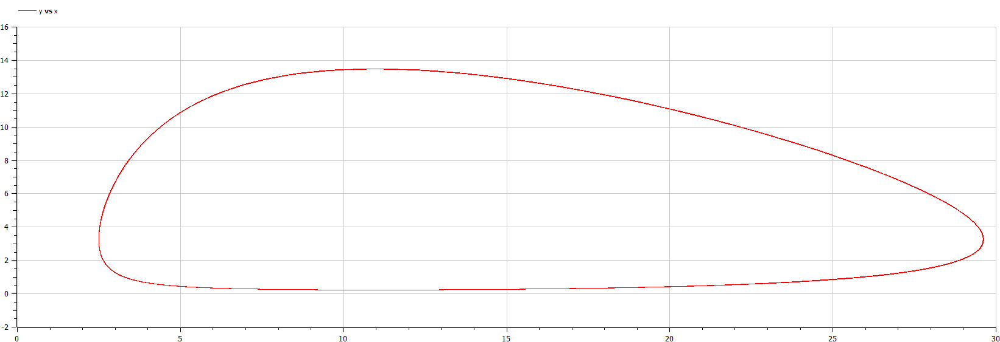
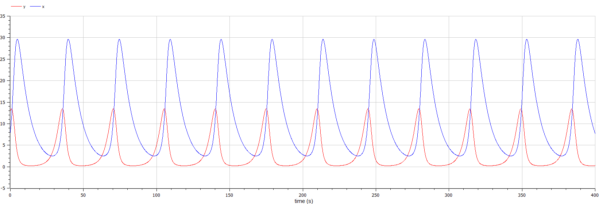
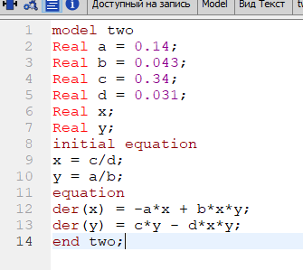
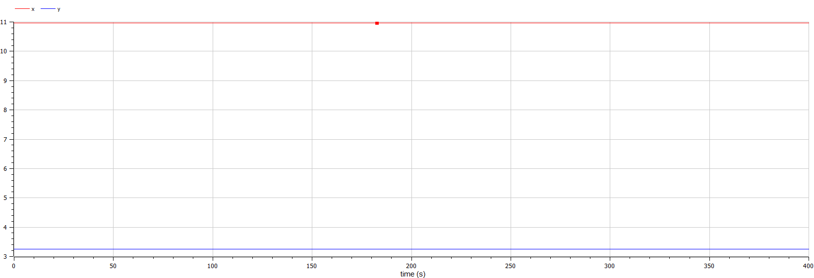

---
## Front matter
title: "Отчёт по лабораторной работе №5"
subtitle: "Модель хищник-жертва"
author: "Егорова Диана Витальевна"

## Generic otions
lang: ru-RU
toc-title: "Содержание"

## Bibliography
bibliography: bib/cite.bib
csl: pandoc/csl/gost-r-7-0-5-2008-numeric.csl

## Pdf output format
toc: true # Table of contents
toc-depth: 2
lof: true # List of figures
lot: true # List of tables
fontsize: 12pt
linestretch: 1.5
papersize: a4
documentclass: scrreprt
## I18n polyglossia
polyglossia-lang:
  name: russian
  options:
	- spelling=modern
	- babelshorthands=true
polyglossia-otherlangs:
  name: english
## I18n babel
babel-lang: russian
babel-otherlangs: english
## Fonts
mainfont: PT Serif
romanfont: PT Serif
sansfont: PT Sans
monofont: PT Mono
mainfontoptions: Ligatures=TeX
romanfontoptions: Ligatures=TeX
sansfontoptions: Ligatures=TeX,Scale=MatchLowercase
monofontoptions: Scale=MatchLowercase,Scale=0.9
## Biblatex
biblatex: true
biblio-style: "gost-numeric"
biblatexoptions:
  - parentracker=true
  - backend=biber
  - hyperref=auto
  - language=auto
  - autolang=other*
  - citestyle=gost-numeric
## Pandoc-crossref LaTeX customization
figureTitle: "Рис."
tableTitle: "Таблица"
listingTitle: "Листинг"
lofTitle: "Список иллюстраций"
lotTitle: "Список таблиц"
lolTitle: "Листинги"
## Misc options
indent: true
header-includes:
  - \usepackage{indentfirst}
  - \usepackage{float} # keep figures where there are in the text
  - \floatplacement{figure}{H} # keep figures where there are in the text
---

# Цель работы

Разобрать задачу Лотки-Вольтерры.

# Задание

Постройте график зависимости численности хищников от численности жертв,
а также графики изменения численности хищников и численности жертв при
следующих начальных условиях: $x_0 = 8, y_0 = 13$. Найти стационарное
состояние системы.

# Теоретическое введение

1. Численность популяции жертв $x$ и хищников $y$ зависят только от времени
(модель не учитывает пространственное распределение популяции на
занимаемой территории)
2. В отсутствии взаимодействия численность видов изменяется по модели
Мальтуса, при этом число жертв увеличивается, а число хищников падает
3. Естественная смертность жертвы и естественная рождаемость хищника
считаются несущественными
4. Эффект насыщения численности обеих популяций не учитывается
5. Скорость роста численности жертв уменьшается пропорционально
численности хищников

$$\frac{dx}{dt} = ax(t)-bx(t)y(t)$$
$$\frac{dy}{dt} = -cy(t) + dx(t)y(t)$$

В этой модели $x$ – число жертв, $y$ - число хищников. Коэффициент $a$ описывает скорость естественного прироста числа жертв в отсутствие хищников, с естественное вымирание хищников, лишенных пищи в виде жертв.   
Вероятность взаимодействия жертвы и хищника считается пропорциональной как количеству жертв, так и числу самих хищников $(xy)$.   
Каждый акт взаимодействия уменьшает популяцию жертв, но способствует увеличению популяции хищников (члены $-bxy$ и $dxy$ в правой части уравнения). 

Стационарное состояние системы (1) (положение равновесия, не зависящее от времени решение) будет в точке: $x_0 = \frac{c}{d}, y_0 = \frac{a}{b}$.   
Если начальные значения задать в стационарном состоянии $x(0)=x_0, y(0)= y_0$, то в любой момент времени численность популяций изменяться не будет. При малом отклонении от положения равновесия численности как хищника, так и жертвы с течением времени не возвращаются к равновесным значениям, а совершают периодические колебания вокруг стационарной точки.   
Амплитуда колебаний и их период определяется начальными значениями численностей $x(0), y(0)$. Колебания совершаются в противофазе.

# Выполнение лабораторной работы

Напишем код программы на julia. Построение зависимости численности популяций хищников и жертв (фазовый портрет системы) и изменение количества численности хищников и жертв при начальном условие (рис. @fig:001).  

{ #fig:001 width=70% } 

Зависимость изменения численности хищников от изменения численности жертв (рис. @fig:002)  

{ #fig:002 width=70% } 

Изменение численности хищников и численности жертв (рис. @fig:003)  

{ #fig:003 width=70% }

Напишем код программы на julia. Найдем стационарное состояние (рис. @fig:004).  

{ #fig:004 width=70% }

Изменение численности хищников и численности жертв (рис. @fig:005)  

{ #fig:005 width=70% }

Смоделируем ситуацию в OpenModelica. Построение зависимости численности популяций хищников и жертв (фазовый портрет системы) и изменение количества численности хищников и жертв при начальном условие (рис. @fig:006).  

{ #fig:006 width=70% }

Зависимость изменения численности хищников от изменения численности жертв (рис. @fig:007)  

{ #fig:007 width=70% }

Изменение численности хищников и численности жертв (рис. @fig:008)  

{ #fig:008 width=70% }

Смоделируем ситуацию в OpenModelica. Найдем стационарное состояние (рис. @fig:009).  

{ #fig:009 width=70% }

Изменение численности хищников и численности жертв (рис. @fig:010)  

{ #fig:010 width=70% }

# Выводы

- Я рассмотрела моделирование ситуации хищник-жертва. 
- В результате выполнения работы получила графики с помощью моделирования на Julia и OpenModelica.
- Построbkf график зависимости численности хищников от численности жертв,a также графики изменения численности хищников и численности жертв при следующих начальных условиях: $x_0 = 8, y_0 = 13$. 
- Нашла стационарное состояние системы.

# Список литературы{.unnumbered}

::: {#refs}
:::
