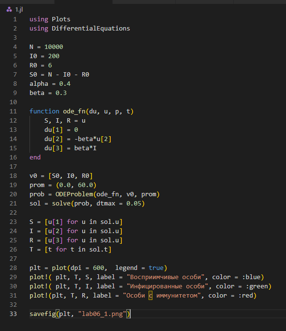
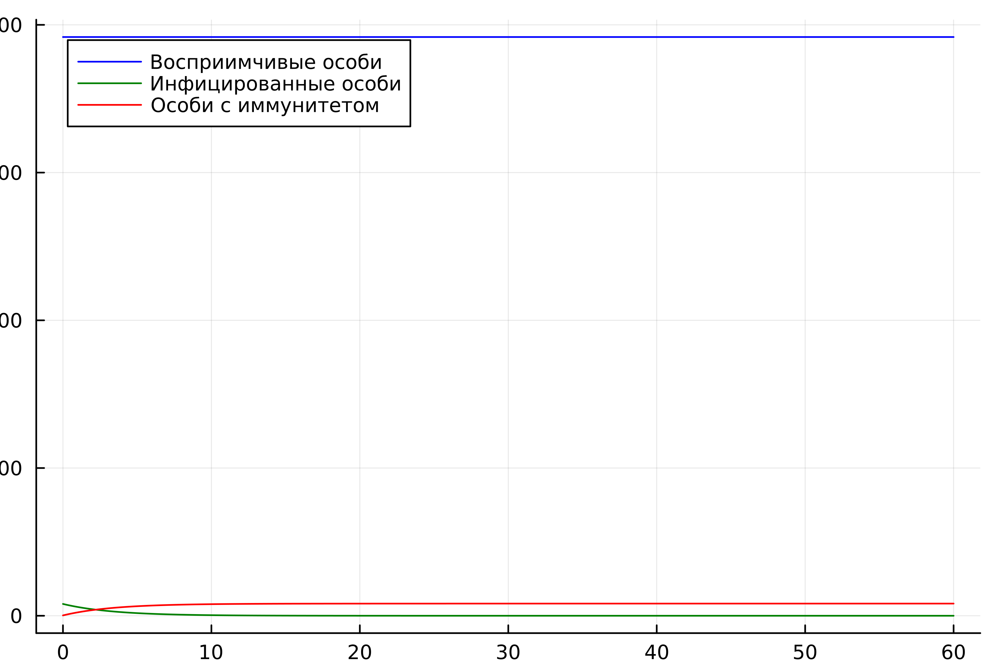
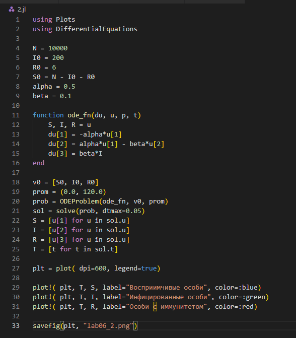
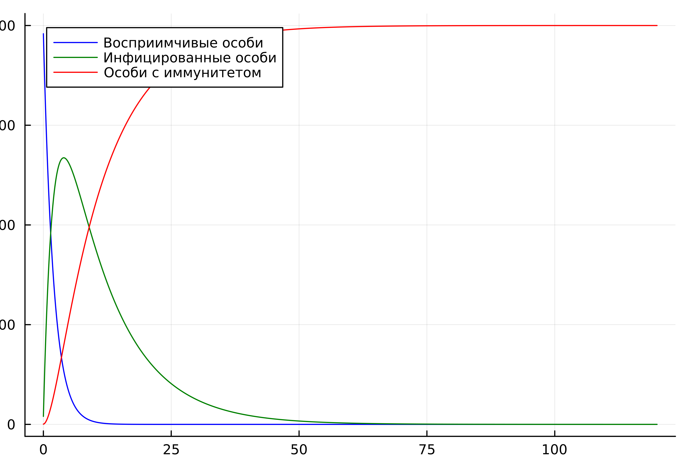
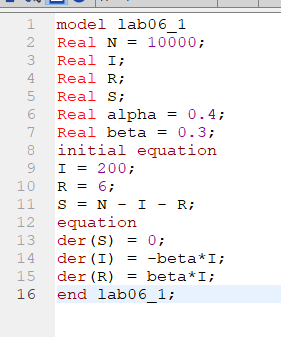
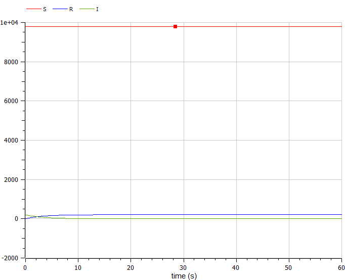
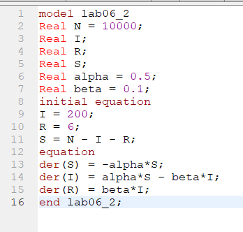
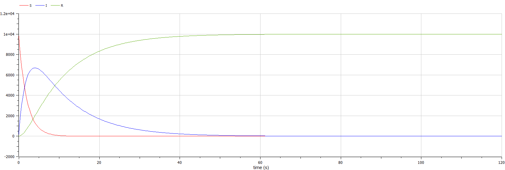

---
## Front matter
lang: ru-RU
title: Лабораторная работа №6
subtitle: "Задача об эпидемии"
author:
  - Егорова Д.В.
institute:
  - Российский университет дружбы народов, Москва, Россия
date: 17 марта 2023

## i18n babel
babel-lang: russian
babel-otherlangs: english

## Formatting pdf
toc: false
toc-title: Содержание
slide_level: 2
aspectratio: 169
section-titles: true
theme: metropolis
mainfont: PT Serif 
romanfont: PT Serif 
sansfont: PT Sans
monofont: PT Mono
header-includes:
 - \metroset{progressbar=frametitle,sectionpage=progressbar,numbering=fraction}
 - '\makeatletter'
 - '\beamer@ignorenonframefalse'
 - '\makeatother'
---

# Информация

## Докладчик

:::::::::::::: {.columns align=center}
::: {.column width="70%"}

  * Егорова Диана Витальевна
  * студент НФИбд-01-20
  * Российский университет дружбы народов
  * [1032201662@rudn.ru](mailto:1032201662@rudn.ru)

:::
::::::::::::::

# Вводная часть

## Актуальность

- Моделирование ситуации
- Наглядное представление
- Простота использования

## Цели и задачи

- Рассмотреть задачу об эпидемии
- Построить графики изменения числа особей в каждой из трех групп.
- Рассмотреть, как будет протекать эпидемия в двух случаях

## Материалы и методы

- Язык `Julia` и ее библиотеки: `Plots` и `DifferentialEquations` для построения графиков
- Свободное открытое программное обеспечение `OpenModelica` для моделирования ситуации 
 
# Ход работы

## Напишем код программы на julia. 

{#fig:001 width=70%}

## График численности особей трех групп S, I, R 

{#fig:002 width=70%}

## Напишем код программы на julia.

{#fig:003 width=70%}

## График для второго случая

{#fig:004 width=70%}

## Смоделируем первый случай в OpenModelica.

{#fig:005 width=70%}

## График численности особей трех групп S, I, R 

{#fig:006 width=70%}

## Смоделируем второй случай в OpenModelica.

{#fig:007 width=70%}

## График численности особей трех групп S, I, R 

{#fig:008 width=70%}

# Результаты
## Результаты
- Моделирование ситуации
- Ознакомление с языками
- Рассмотрение задачи об эпидемии
- Построение графики изменения числа особей в каждой из трех групп
- Ознакомление, как будет протекать эпидемия в двух случаях

