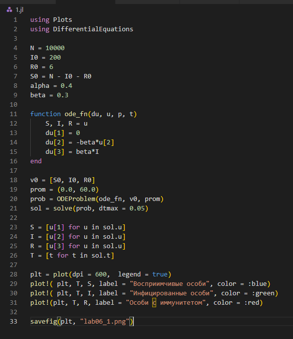
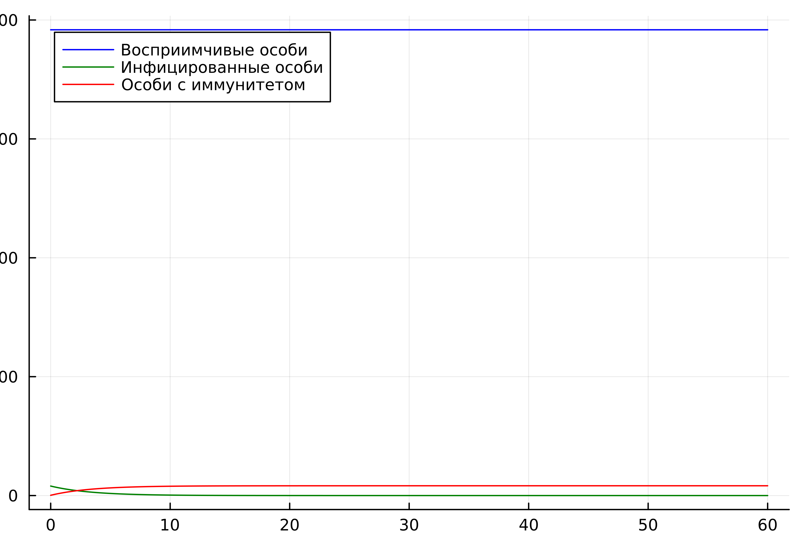
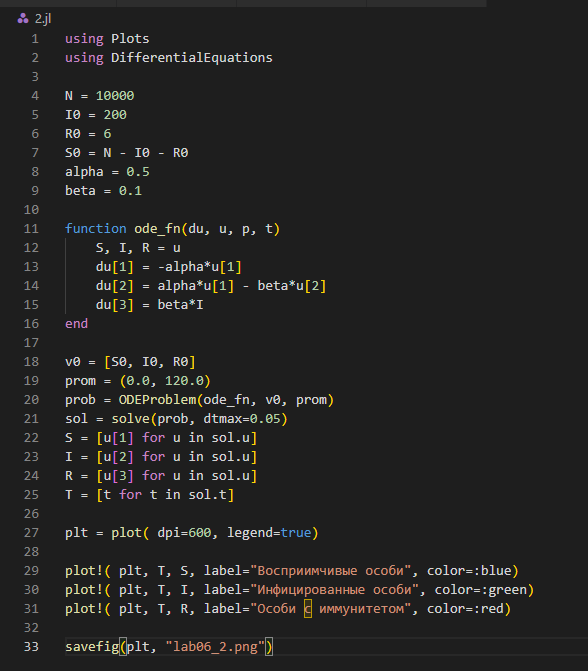
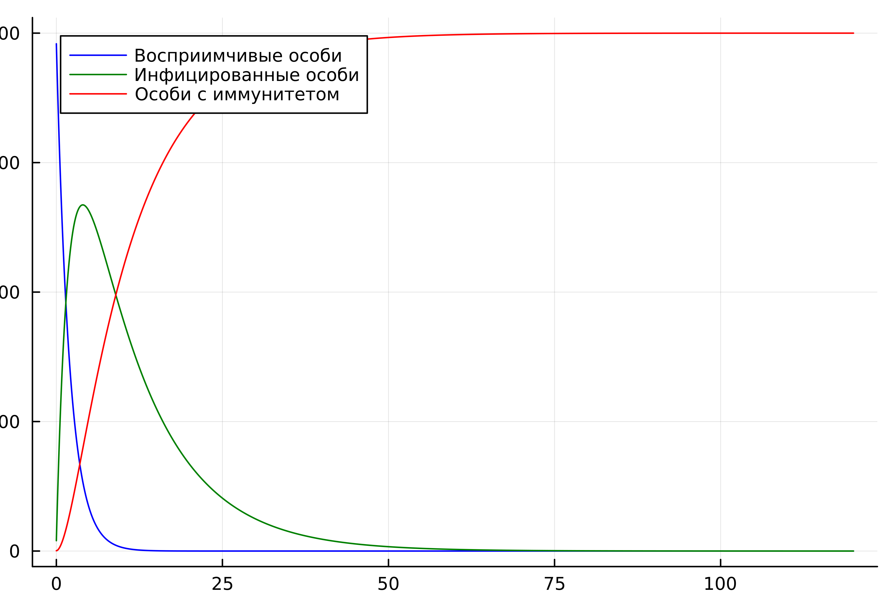
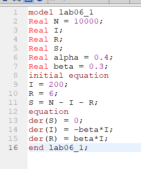
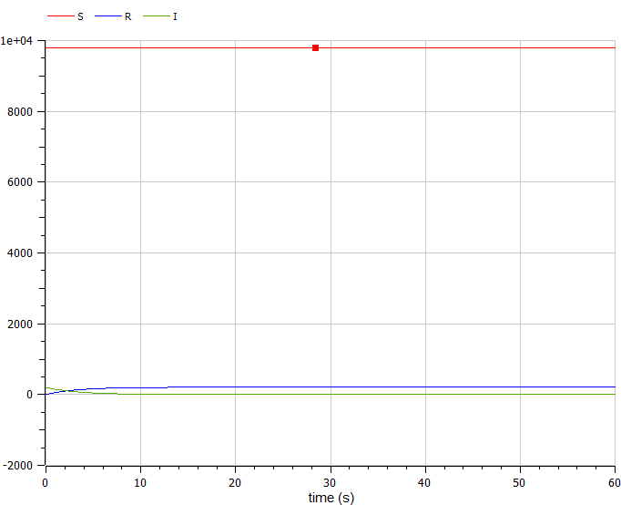
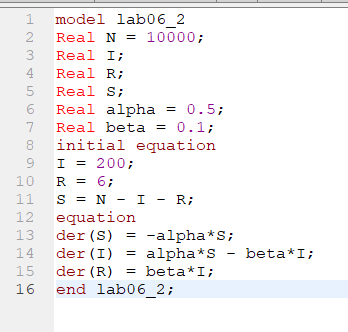
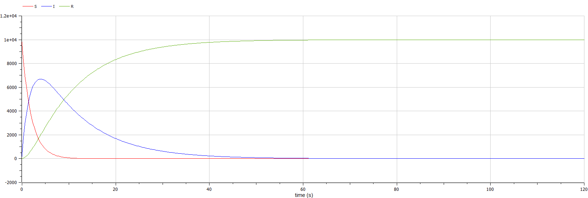

---
## Front matter
title: "Отчет по лабораторной работе № 6"
subtitle: "Задача об эпидемии"
author: "Егорова Диана Витальевна"

## Generic otions
lang: ru-RU
toc-title: "Содержание"

## Bibliography
bibliography: bib/cite.bib
csl: pandoc/csl/gost-r-7-0-5-2008-numeric.csl

## Pdf output format
toc: true # Table of contents
toc-depth: 2
lof: true # List of figures
lot: true # List of tables
fontsize: 12pt
linestretch: 1.5
papersize: a4
documentclass: scrreprt
## I18n polyglossia
polyglossia-lang:
  name: russian
  options:
	- spelling=modern
	- babelshorthands=true
polyglossia-otherlangs:
  name: english
## I18n babel
babel-lang: russian
babel-otherlangs: english
## Fonts
mainfont: PT Serif
romanfont: PT Serif
sansfont: PT Sans
monofont: PT Mono
mainfontoptions: Ligatures=TeX
romanfontoptions: Ligatures=TeX
sansfontoptions: Ligatures=TeX,Scale=MatchLowercase
monofontoptions: Scale=MatchLowercase,Scale=0.9
## Biblatex
biblatex: true
biblio-style: "gost-numeric"
biblatexoptions:
  - parentracker=true
  - backend=biber
  - hyperref=auto
  - language=auto
  - autolang=other*
  - citestyle=gost-numeric
## Pandoc-crossref LaTeX customization
figureTitle: "Рис."
tableTitle: "Таблица"
listingTitle: "Листинг"
lofTitle: "Список иллюстраций"
lotTitle: "Список таблиц"
lolTitle: "Листинги"
## Misc options
indent: true
header-includes:
  - \usepackage{indentfirst}
  - \usepackage{float} # keep figures where there are in the text
  - \floatplacement{figure}{H} # keep figures where there are in the text
---

# Цель работы

Рассмотреть задачу об эпидемии

# Задание

Построить графики изменения числа особей в каждой из трех групп.
Рассмотреть, как будет протекать эпидемия в случае:
- если $I(0)\le I^*$
- если $I(0)>I^*$

# Теоретическое введение

Рассмотрим простейшую модель эпидемии. Предположим, что некая
популяция, состоящая из $N$ особей, (считаем, что популяция изолирована)
подразделяется на три группы. Первая группа - это восприимчивые к болезни, но
пока здоровые особи, обозначим их через $S(t)$. Вторая группа – это число
инфицированных особей, которые также при этом являются распространителями
инфекции, обозначим их $I(t)$. А третья группа, обозначающаяся через $R(t)$ – это
здоровые особи с иммунитетом к болезни.  

До того, как число заболевших не превышает критического значения $I*$, считаем, что все больные изолированы и не заражают здоровых. Когда $I(t)>I^*$ ,
тогда инфицирование способны заражать восприимчивых к болезни особей.
Таким образом, скорость изменения числа $S(t)$ меняется по следующему
закону:

$$\frac{d(I)}{dt} = \begin{cases} -\alpha S & , I(t)>I^* \\ 0 & , I(t)\le I^* \end{cases}$$

Поскольку каждая восприимчивая к болезни особь, которая, в конце концов,
заболевает, сама становится инфекционной, то скорость изменения числа
инфекционных особей представляет разность за единицу времени между
заразившимися и теми, кто уже болеет и лечится, т.е.:

$$\frac{d(S)}{dt} = \begin{cases} \alpha S -\beta I & ,   I(t)>I^* \\ -\beta I & , I(t)\le I^* \end{cases}$$

А скорость изменения выздоравливающих особей (при этом приобретающие
иммунитет к болезни)

$$\frac{d(R)}{d(t)}=\beta I$$

Постоянные пропорциональности $\alpha , \beta$, - это коэффициенты заболеваемости
и выздоровления соответственно.
Для того, чтобы решения соответствующих уравнений определялось
однозначно, необходимо задать начальные условия .Считаем, что на начало
эпидемии в момент времени $t=0$ нет особей с иммунитетом к болезни $R(0)=0$, а
число инфицированных и восприимчивых к болезни особей
$I(0)$ и $S(0)$
соответственно. Для анализа картины протекания эпидемии необходимо
рассмотреть два случая: $I(0)\le I^* , I(0)>I^*$

# Выполнение лабораторной работы

Напишем код программы на Julia (рис. @fig:001) .

{#fig:001 width=70%}

В результате получаем следующий график (рис. @fig:002).

{#fig:002 width=70%}

Напишем код для второй программы на Julia (рис. @fig:003).

{#fig:003 width=70%}

В результате получаем следующий график (рис. @fig:004).

{#fig:004 width=70%}

Напишем код программы в OpenModelica (рис. @fig:005).

{#fig:005 width=70%}

В результате получаем следующий график (рис. @fig:006).

{#fig:006 width=70%}

Напишем код программы для второго случая в OpenModelica (рис. @fig:007).

{#fig:007 width=70%}

В результате получаем следующий график (рис. @fig:008).

{#fig:008 width=70%}

# Выводы

Я построила графики изменения числа особей в каждой из трех групп.
Рассмотрите, как будет протекать эпидемия в двух случаях.

# Список литературы{.unnumbered}

::: {#refs}
:::
