---
## Front matter
title: "Отчёт по лабораторной работе № 7"
subtitle: "Эффективность рекламы"
author: "Егорова Диана Витальевна"

## Generic otions
lang: ru-RU
toc-title: "Содержание"

## Bibliography
bibliography: bib/cite.bib
csl: pandoc/csl/gost-r-7-0-5-2008-numeric.csl

## Pdf output format
toc: true # Table of contents
toc-depth: 2
lof: true # List of figures
lot: true # List of tables
fontsize: 12pt
linestretch: 1.5
papersize: a4
documentclass: scrreprt
## I18n polyglossia
polyglossia-lang:
  name: russian
  options:
	- spelling=modern
	- babelshorthands=true
polyglossia-otherlangs:
  name: english
## I18n babel
babel-lang: russian
babel-otherlangs: english
## Fonts
mainfont: PT Serif
romanfont: PT Serif
sansfont: PT Sans
monofont: PT Mono
mainfontoptions: Ligatures=TeX
romanfontoptions: Ligatures=TeX
sansfontoptions: Ligatures=TeX,Scale=MatchLowercase
monofontoptions: Scale=MatchLowercase,Scale=0.9
## Biblatex
biblatex: true
biblio-style: "gost-numeric"
biblatexoptions:
  - parentracker=true
  - backend=biber
  - hyperref=auto
  - language=auto
  - autolang=other*
  - citestyle=gost-numeric
## Pandoc-crossref LaTeX customization
figureTitle: "Рис."
tableTitle: "Таблица"
listingTitle: "Листинг"
lofTitle: "Список иллюстраций"
lotTitle: "Список таблиц"
lolTitle: "Листинги"
## Misc options
indent: true
header-includes:
  - \usepackage{indentfirst}
  - \usepackage{float} # keep figures where there are in the text
  - \floatplacement{figure}{H} # keep figures where there are in the text
---

# Цель работы

Рассмотреть моделирование ситуации "Эффективность рекламы".

# Задание

Постройте график распространения рекламы, математическая модель которой описывается
следующим уравнением:

1. $$\frac{d(n)}{dt} = (0.55 + 0.0001n(t))(N - n(t))$$
2. $$\frac{d(n)}{dt} = (0.00005 + 0.2n(t))(N - n(t))$$
3. $$\frac{d(n)}{dt} = (0.5\sin t + 0.3\cos t n(t))(N - n(t))$$

# Теоретическое введение
Организуется рекламная кампания нового товара или услуги. Необходимо,
чтобы прибыль будущих продаж с избытком покрывала издержки на рекламу.
Вначале расходы могут превышать прибыль, поскольку лишь малая часть
потенциальных покупателей будет информирована о новинке. Затем, при
увеличении числа продаж, возрастает и прибыль, и, наконец, наступит момент,
когда рынок насытиться, и рекламировать товар станет бесполезным.  

Предположим, что торговыми учреждениями реализуется некоторая
продукция, о которой в момент времени $t$
из числа потенциальных покупателей $N$
знает лишь $n$
покупателей. Для ускорения сбыта продукции запускается реклама
по радио, телевидению и других средств массовой информации. После запуска
рекламной кампании информация о продукции начнет распространяться среди
потенциальных покупателей путем общения друг с другом. Таким образом, после
запуска рекламных объявлений скорость изменения числа знающих о продукции
людей пропорциональна как числу знающих о товаре покупателей, так и числу
покупателей о нем не знающих.  

Модель рекламной кампании описывается следующими величинами.
Считаем, что $\frac{dn}{dt}$ - скорость изменения со временем числа потребителей,
узнавших о товаре и готовых его купить, $t$ - время, прошедшее с начала рекламной
кампании, $n(t)$ - число уже информированных клиентов. Эта величина
пропорциональна числу покупателей, еще не знающих о нем, это описывается
следующим образом: $\alpha_1(t)(N-n(t))$, где $N$ - общее число потенциальных
платежеспособных покупателей, $\alpha_1(t) > 0$- характеризует интенсивность
рекламной кампании (зависит от затрат на рекламу в данный момент времени).
Помимо этого, узнавшие о товаре потребители также распространяют полученную
информацию среди потенциальных покупателей, не знающих о нем (в этом случае
работает т.н. сарафанное радио). Этот вклад в рекламу описывается величиной
$\alpha_2(t)n(t)(N-n(t))$ , эта величина увеличивается с увеличением потребителей
узнавших о товаре. Математическая модель распространения рекламы описывается
уравнением:

$$\frac{dn}{dt}= (\alpha_1(t) + \alpha_2(t)n(t))(N-n(t))$$

# Выполнение лабораторной работы

Напишем код программы на Julia (рис. @fig:001) .

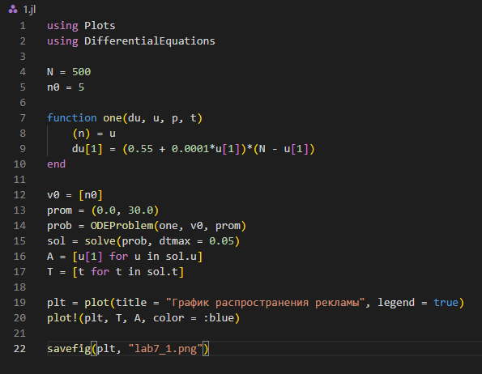{#fig:001 width=70%}

В результате получаем следующий график (рис. @fig:002).

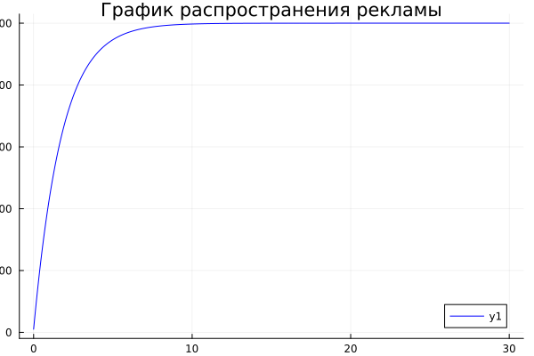{#fig:002 width=70%}

Напишем код для второй программы на Julia (рис. @fig:003).

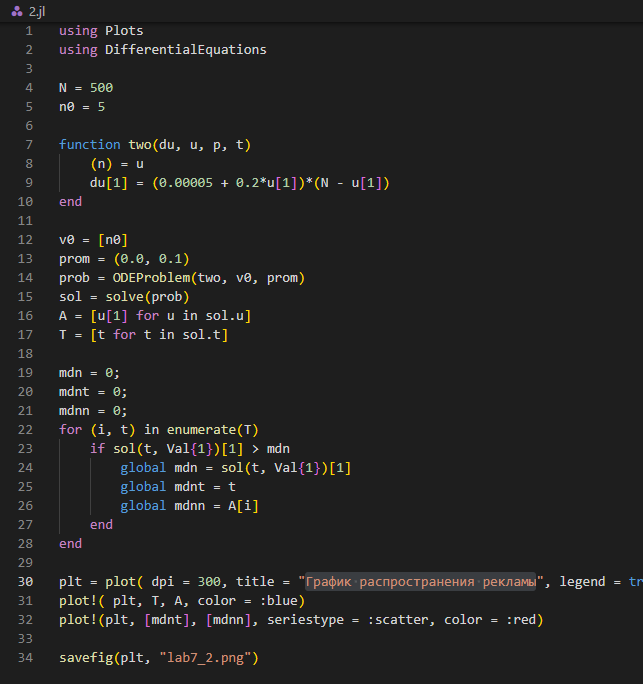{#fig:003 width=70%}

В результате получаем следующий график (рис. @fig:004).

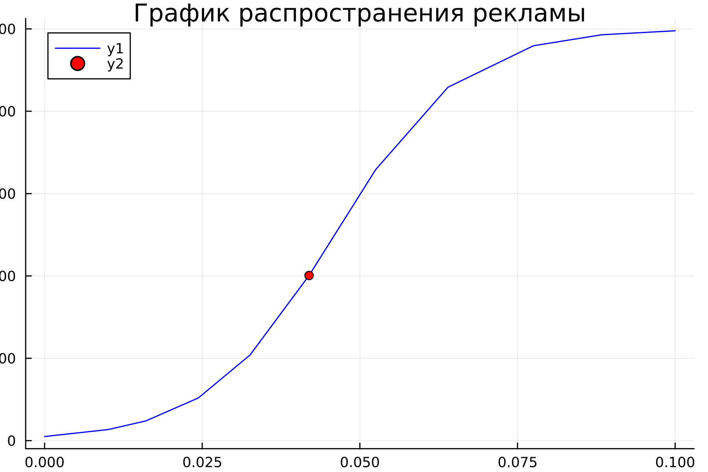{#fig:004 width=70%}

Напишем код для третьей программы на Julia (рис. @fig:005).

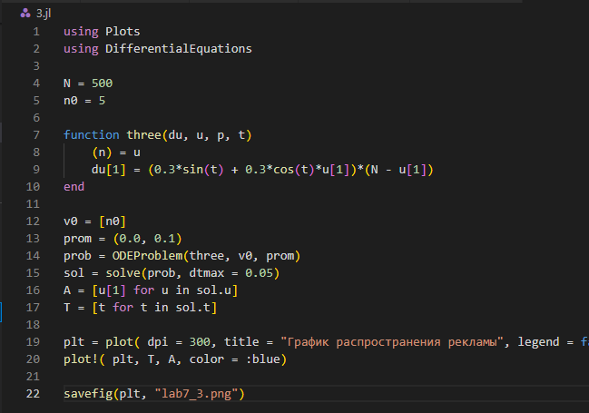{#fig:005 width=70%}

В результате получаем следующий график (рис. @fig:006).

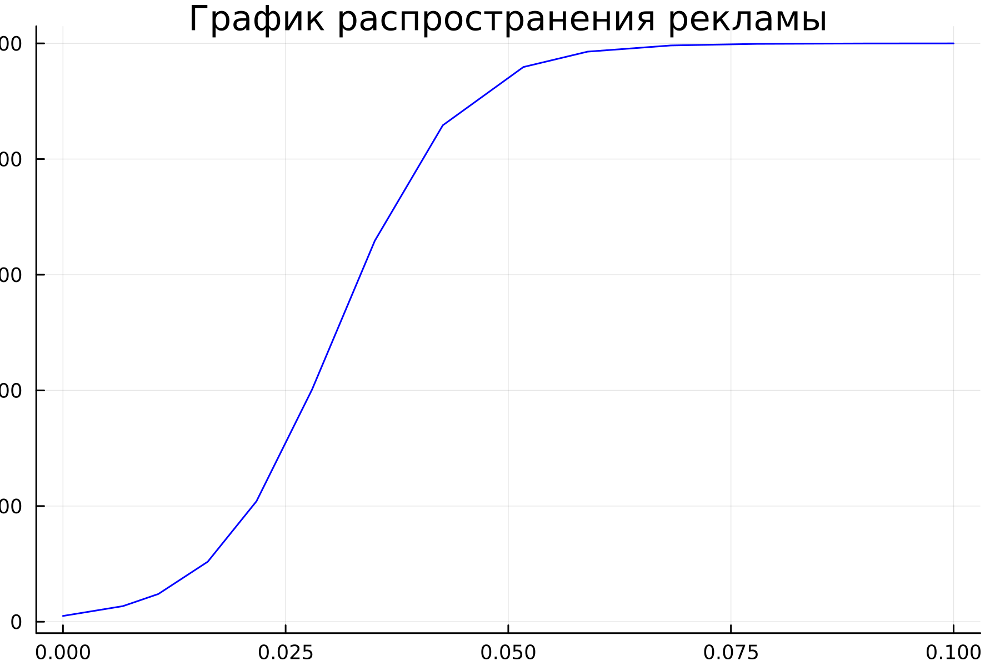{#fig:006 width=70%}

Напишем код программы в OpenModelica (рис. @fig:007).

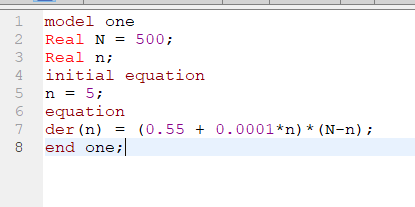{#fig:007 width=70%}

В результате получаем следующий график (рис. @fig:008).

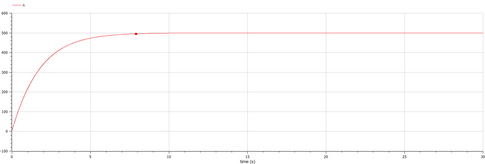{#fig:008 width=70%}

Напишем код программы для второго случая в OpenModelica (рис. @fig:009).

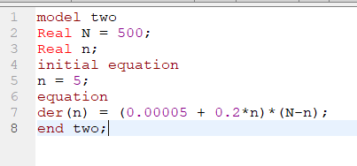{#fig:009 width=70%}

В результате получаем следующий график (рис. @fig:010).

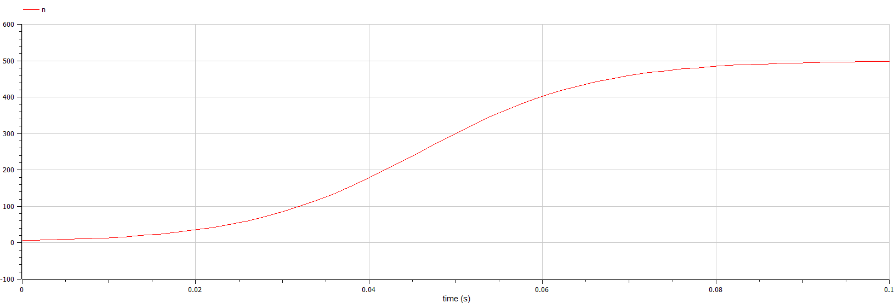{#fig:010 width=70%}

Напишем код программы для третьего случая в OpenModelica (рис. @fig:011).

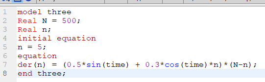{#fig:011 width=70%}

В результате получаем следующий график (рис. @fig:012).

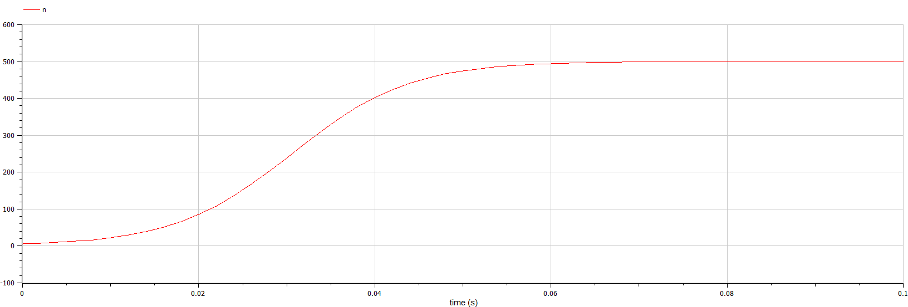{#fig:012 width=70%}

# Выводы

Я построила графики рекламы, математическая модель которой описывается следующим уравнением:
1. $\frac{d(n)}{dt} = (0.55 + 0.0001n(t))(N - n(t))$
2. $\frac{d(n)}{dt} = (0.00005 + 0.2n(t))(N - n(t))$
3. $\frac{d(n)}{dt} = (0.5\sin t + 0.3\cos t n(t))(N - n(t))$

# Список литературы{.unnumbered}

::: {#refs}
:::
