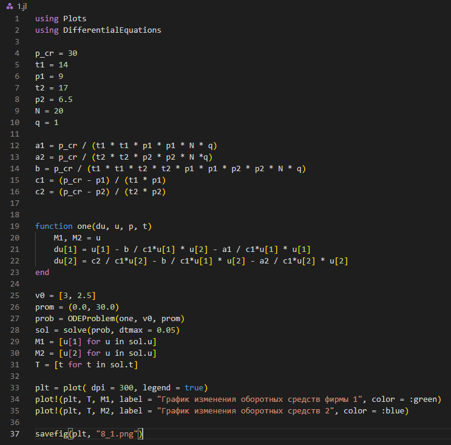
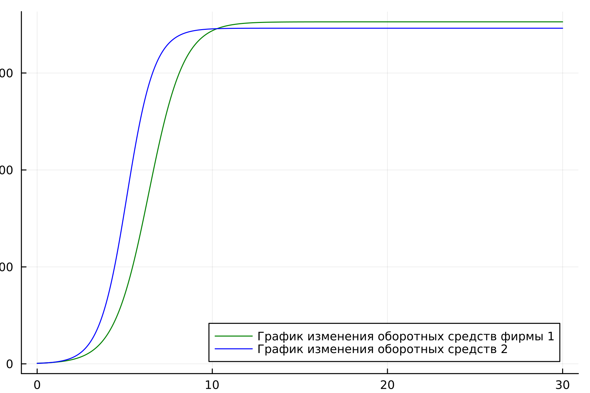
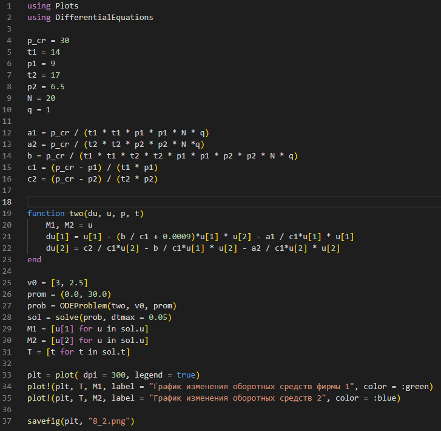
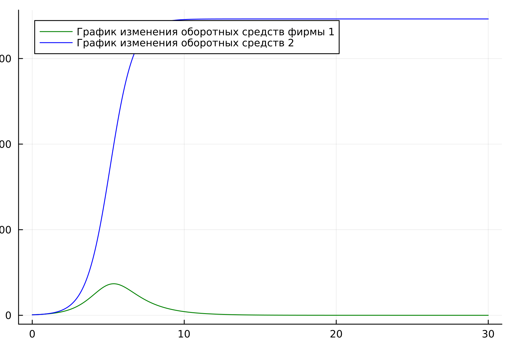
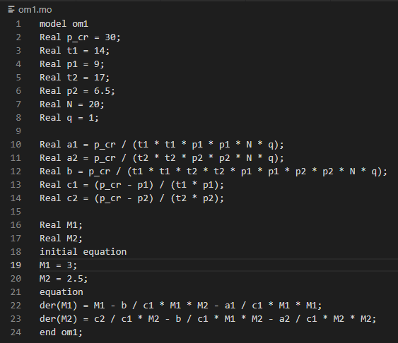
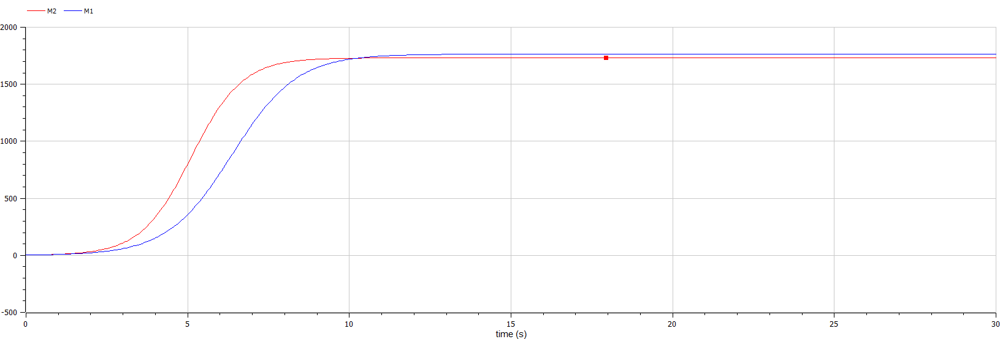
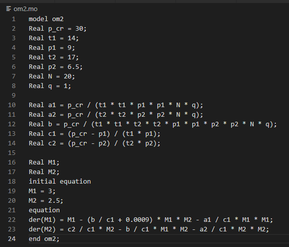
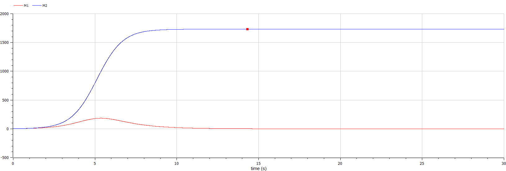

---
## Front matter
title: "Jтчёт по лабораторной работе №8 "
subtitle: "Модель конкуренции двух фирм"
author: "Егорова Диана Витальевна"

## Generic otions
lang: ru-RU
toc-title: "Содержание"

## Bibliography
bibliography: bib/cite.bib
csl: pandoc/csl/gost-r-7-0-5-2008-numeric.csl

## Pdf output format
toc: true # Table of contents
toc-depth: 2
lof: true # List of figures
lot: true # List of tables
fontsize: 12pt
linestretch: 1.5
papersize: a4
documentclass: scrreprt
## I18n polyglossia
polyglossia-lang:
  name: russian
  options:
	- spelling=modern
	- babelshorthands=true
polyglossia-otherlangs:
  name: english
## I18n babel
babel-lang: russian
babel-otherlangs: english
## Fonts
mainfont: PT Serif
romanfont: PT Serif
sansfont: PT Sans
monofont: PT Mono
mainfontoptions: Ligatures=TeX
romanfontoptions: Ligatures=TeX
sansfontoptions: Ligatures=TeX,Scale=MatchLowercase
monofontoptions: Scale=MatchLowercase,Scale=0.9
## Biblatex
biblatex: true
biblio-style: "gost-numeric"
biblatexoptions:
  - parentracker=true
  - backend=biber
  - hyperref=auto
  - language=auto
  - autolang=other*
  - citestyle=gost-numeric
## Pandoc-crossref LaTeX customization
figureTitle: "Рис."
tableTitle: "Таблица"
listingTitle: "Листинг"
lofTitle: "Список иллюстраций"
lotTitle: "Список таблиц"
lolTitle: "Листинги"
## Misc options
indent: true
header-includes:
  - \usepackage{indentfirst}
  - \usepackage{float} # keep figures where there are in the text
  - \floatplacement{figure}{H} # keep figures where there are in the text
---

# Цель работы

1. Рассмотреть модель конкуренции двух фирм
2. Рассмотреть первый и второй случаи конкуренции

# Задание

1. Построить графики изменения оборотных средств фирмы 1 и фирмы 2 без
учета постоянных издержек и с веденной нормировкой для случая 1.
2. Постройте графики изменения оборотных средств фирмы 1 и фирмы 2 без
учета постоянных издержек и с веденной нормировкой для случая 2.

# Теоретическое введение

Рассмотрим две фирмы, производящие взаимозаменяемые товары
одинакового качества и находящиеся в одной рыночной нише. Считаем, что в рамках
нашей модели конкурентная борьба ведётся только рыночными методами. То есть,
конкуренты могут влиять на противника путем изменения параметров своего
производства: себестоимость, время цикла, но не могут прямо вмешиваться в
ситуацию на рынке («назначать» цену или влиять на потребителей каким-либо иным
способом.) Будем считать, что постоянные издержки пренебрежимо малы, и в
модели учитывать не будем. В этом случае динамика изменения объемов продаж
фирмы 1 и фирмы 2 описывается следующей системой уравнений:

$$\frac{d(M_1)}{d(\theta)} = M_1 - \frac{b}{c_1}M_1M_2-\frac{a_1}{c_1}M_1^2$$

$$\frac{d(M_2)}{d(\theta)} = \frac{c_2}{c_1}M_2 - \frac{b}{c_1}M_1M_2-\frac{a_2}{c_1}M_2^2$$

Случай 2. Рассмотрим модель, когда, помимо экономического фактора
влияния (изменение себестоимости, производственного цикла, использование
кредита и т.п.), используются еще и социально-психологические факторы –
формирование общественного предпочтения одного товара другому, не зависимо от
их качества и цены. В этом случае взаимодействие двух фирм будет зависеть друг
от друга, соответственно коэффициент перед $M_1M_2$
будет отличаться. Пусть в рамках рассматриваемой модели динамика изменения объемов продаж фирмы 1 и
фирмы 2 описывается следующей системой уравнений:

$$\frac{d(M_1)}{d(\theta)} = M_1 - (\frac{b}{c_1}+0.0009) M_1M_2-\frac{a_1}{c_1}M_1^2$$

$$\frac{d(M_2)}{d(\theta)} = \frac{c_2}{c_1}M_2 - \frac{b}{c_1}M_1M_2-\frac{a_2}{c_1}M_2^2$$

Обозначения:
$N$ – число потребителей производимого продукта.
$\tau$ – длительность производственного цикла
$p$ – рыночная цена товара
$\tildep$– себестоимость продукта, то есть переменные издержки на производство единицы
продукции.
$q$ – максимальная потребность одного человека в продукте в единицу времени
$\theta = \frac{t}{c_1}$ - безразмерное время

# Выполнение лабораторной работы

Напишем код программы на Julia (рис. @fig:001) .

{#fig:001 width=70%}

В результате получаем следующий график (рис. @fig:002).

{#fig:002 width=70%}

Напишем код для второй программы на Julia (рис. @fig:003).

{#fig:003 width=70%}

В результате получаем следующий график (рис. @fig:004).

{#fig:004 width=70%}

Напишем код программы в OpenModelica (рис. @fig:005).

{#fig:005 width=70%}

В результате получаем следующий график (рис. @fig:006).

{#fig:006 width=70%}

Напишем код для второй программы в OpenModelica (рис. @fig:007).

{#fig:007 width=70%}

В результате получаем следующий график (рис. @fig:008).

{#fig:008 width=70%}

# Выводы

Мы изучили задачу о модели конкуренции двух фирм. Построили графики изменения оборотных средств фирмы 1 и фирмы 2 без
учета постоянных издержек и с веденной нормировкой для случая 1. Построили графики изменения оборотных средств фирмы 1 и фирмы 2 без
учета постоянных издержек и с веденной нормировкой для случая 2.

# Список литературы{.unnumbered}

::: {#refs}
:::
